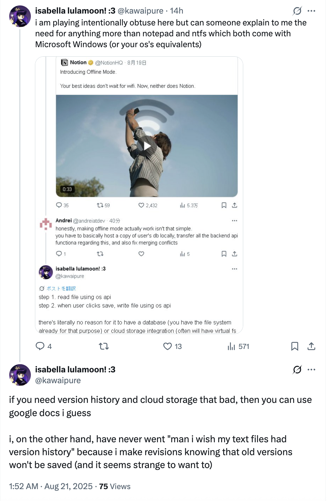

+++
date = '2025-08-21T15:59:02+02:00'
title = 'Awful Tech Takes Galore! - A gallery of awful tech takes.'
categories = ['computers']
tags = ['opinion']
+++

Some people have a very trashy taste when it comes to technology and frankly sometimes it makes me want to pull my head out of my spine. Some people genuinely never had experience with using their computers or any technology seriously and may, in fact, criticize you for using something that's comfortable with you and your workflow.

Technology is vast. That sphere of multiple usecase situations makes some brainlets scream, so I'll stick to that side of tech takes. Simple user choice, that's all.

# Exhibit A: "I don't get why a note-taking app exists."

Notion offline is a gamechanger for Notion users. Not that I use it, or like using it, since it doesn't bode well with the fact I do most if not all of my notetaking in handwriting since it's a much better alternative than trying to highlight, emphasize and write on text. Even though it makes my hand hurt simply because I write too fast, it's just the best way I can take notes.

I kinda drifted far from the point, but what @kawaipure says on X is strange. Let's compare what usecases and situations you'd use Notion for with what you can do in Notepad and your Filesystem

- Notion can make templates for situational notes. Like journaling, class highlights, etc.

- Notion has a built-in LLM tool that's, again, useful for highlighting notes and summarizing, as well as writing

- Notion has version control, in case a certain paragraph which has been mistakenly deleted either by accident or deliberately needs to be restored. It has nothing to do with [multiple cases of AI straight up erasing people's work.](https://www.reddit.com/r/cursor/comments/1k34mrn/cursor_deleted_everything_wtf/)

- Notion is not really a notetaking application by itself - Its primary usecase is for you to make shared documents with people and to make it easier on your eyes.

- Notion has been famously used by [Theo Browne](https://x.com/theo) to keep track of his video ideas, descriptions, sources et cetera in cards, which are nested in his notes.

Notepad?

- Had a bug that garbled text when you saved the contents `bush hid the facts`.

- Can only save Text

- Doesn't have nested objects, or objects at all. It's all plain text

- Rich text isn't present. Again, Plain text.

- At least it has Copilot

If you think like this user, you're probably not thinking right when you realize some people REALLY depend on the versatility of Notion and the ability to put Rich Content (Not just text!) in their documents. Notion Offline just brings that offline, since it was a **Collaboration-first experience**

# Exhibit B: "I'll make my whole livelihood about hating on Apple"

Admittedly, Apple is NOT a good company, by a LOT of standards. Some mistakes they make are DIABOLICAL, but I'd like to divert your attention to someone whose entire online presence revolves around bashing Apple.

This person has almost 25 thousand followers that she got by relentlessly hating on Apple.

Apple is not a company wirth having almost 65 thousand posts over. You read that right - 65 thousand posts. Though, that metric is skewed since there are many replies for this account that joined in 2022.

Now I'll delve into personal specifics about this account. This account is allegedly owned by someone named "Jenny", a woman who has mental troubles. *I'm not even going to entertain the idea of gender analysis since it's entirely irrelevant to this situation.*

Jenny is someone who, according to herself, has no other personal accounts. Operational security? Sure! But that's a bold thing to lie about when the entire account is dedicated to relentlessly hating on a brand.

This profile has no concrete idiotic tech take, as most of the account is literally full of examples of how this person is iconically terrible at posting technology "dunks"

Let's see a few examples of it:

This is only a good take for those using old laptops. The ports seen that are removed on these are:

1. Thunderbolt 2 (same port as MiniDP)

2. Ethernet

3. USB 2/3

4. FireWire

5. Kesington port

Now I don't want to have to explain how FireWire is obsolete, but the thing is Apple restored MagSafe, HDMI and the SD port.

The thing was - these ports I mentioned are genuinely obsolete and big setbacks in the macOS ecosystem. Apple did make these changes to further push adoption of new technologies, as newer laptops during those times still had Serial/Parallel and PS/2 ports.

Now I'd continue - if not for the fact that the account posted conspiracy theories about biblical meanins of the Apple logo.

Concerning behavior. Genuinely concerning, since Jenny did mention she used this account to vent out her mental problems.

Even if she were lying about it all - This account posts daily, with no pause. Genuinely a gimmick account with a financial incentive considering she has her blue checkmark out and about.

Even if we omitted everything I said before - This account has an unhealthy obsession with Apple and should seek maximal therapy.

# Exhibit C: AI is not "bad" at all. You're a luddite who needs help

AI is inherently a good concept, but you'd have to be living under a rock to not notice the amount of people who utterly oppose AI anywhere.

An example: Self-custodial AI integration into ShareX, a popular screenshot manager software.

Try being one of those people who still think like this.

This is one of many stances people hold. "Slop", "Environment", "AI makes you dumber" and more bullshit arguments like "Plagiarism" and some moral bullshit.

Truth be told - Large Language Models are a step forward in society for many reasons and many usecases, simply because it provides a worthy interface for looking information up. But some people use it wrong, and some people are looking for reasons not to use it.

There was a popular scandal regarding [Kenyans being abused for little pay to moderate content fed into training material](https://www.theguardian.com/technology/2023/aug/02/ai-chatbot-training-human-toll-content-moderator-meta-openai) but OpenAI has since switched away from Sama (The company responsible for the Kenyans) to an automated solution, the likes of which used by Meta in Facebook.

Liquid cooling in server farms like you see in Microsoft or Amazon are all closed-loo systems, which cool hot water (or whichever liquid enterprises use - there's a whole fucking conundrum regarding NVIDIA servers, especially old ones, and their liquid cooling loops often requiring idiotic amounts of attention to replace)

Power usage of AI server farms is no different than render farms which consume MUCH MORE ELECTRICITY due to the sheer amount of processing they have to commit to. Video rendering pipelines aren't exactly "hungrier" than technologies like CUDA or OpenCL on which LLMs infer, but the scale is much higher than users of services like ChatGPT, especially when you realize that they're given to people nilly-willy on services like YouTube where every single video is transcoded into different qualities.

Plagiarism is bound to happen in any scraped material, which is what OpenAI and the works train their content on. It's not bad at all, and it should be encouraged, because security by obscurity is how information gets hidden and shunned away. Maybe the book you hid from an AI scraper contains crucial info that, if opposed by a hallucination, could anger you. Have you thought about that?

Have you thought about the many times AI has hallucinated because it assumes stuff exists? You could blame lack of information, but I also blame a lack of ability to correctly predict due to how many people are hiding their information. The web is free, open and awesome. Obscuring information for any reason is pedantically stupid.

# Exhibit D: The web is NOT just "Rich Remote Document Viewing"

Back to user @kawaipure, I think that this post requires a special spot in the hall of shame.

The whole thread ends [here](https://x.com/kawaipure/status/1929525217728123248) and you can feel free to read it *(TL;DR: It's about web technologies like WebSerial and WebUSB)*

The web platform has evolved way past that with Flash, and after that people expected their websites to run something like Software, that wasn't really software locally installed.

Local software has a much larger attack vector surface than sandboxed software, and as far as I'm concerned, I'd rather flash firmware from a website that lets me pick a specific device, and not a program that is shaky with that.

WebSerial has been a saving grace, but many technologies like WebBluetooth, WebUSB and WebMIDI have been REJECTED by many browser developers, citing security concerns.

There aren't any concerns to address. When you want to use a site that utilizes a physical connection API, you have to ask the browser for a device. The browser then hands **YOU, THE USER**, a prompt with a list of devices you can send to the website, with the option to cancel. It does not intrude on you, it does not nag you. You have the option to cancel, close the tab, walk away.

# Epilogue

Please don't post idiotic takes. X suffers from [toasterfuck syndrome](https://www.reddit.com/r/196/comments/mcvhf3/rool/).
